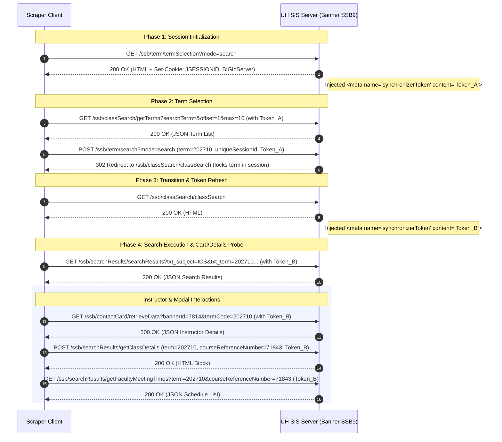
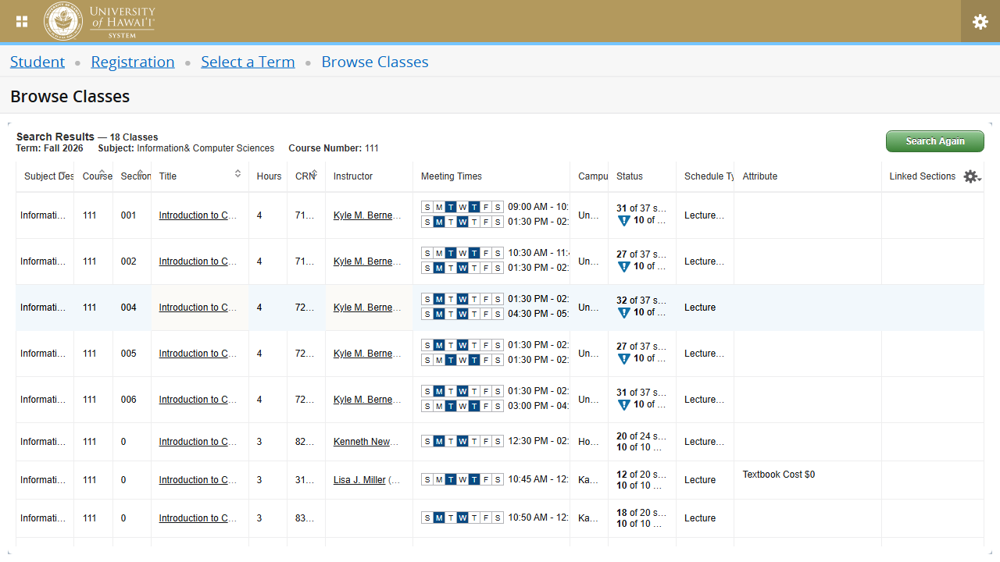
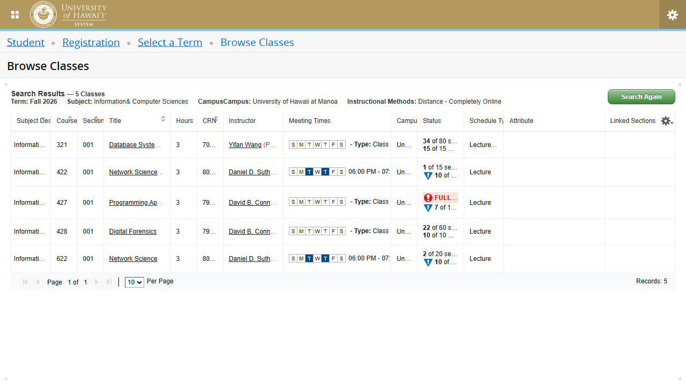
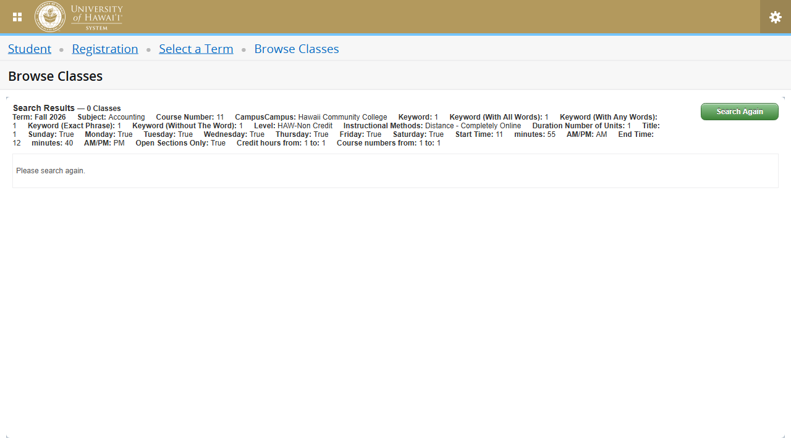
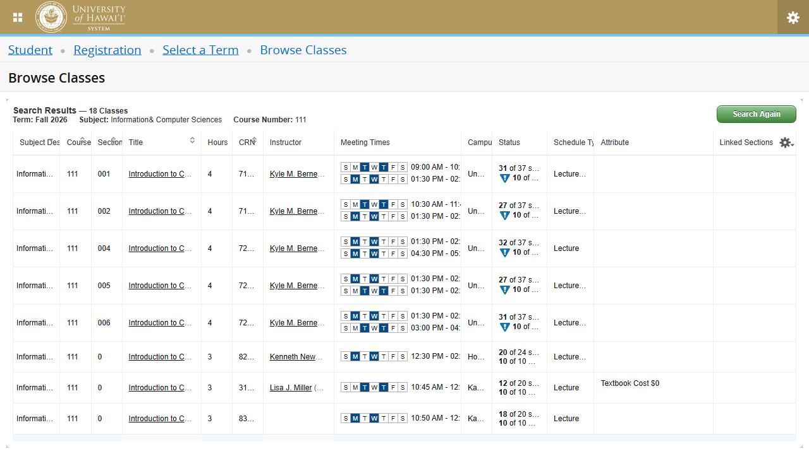

# Walkthrough: UH SIS Banner SSB9 API Reverse Engineering

This walkthrough documents the reverse engineering findings for the University of Hawaii's Student Information System (Ellucian Banner SSB9) course search interface, including instructor contact card retrieval, details modal sub-endpoints, and full browse classes search parameters.

## 1. Request Lifecycle & Token Propagation

The system relies on a stateful JavaEE session (Tomcat) behind an F5 BIG-IP load balancer. To programmatically query course catalog data, request sequences must occur in a specific order to establish session state and propagate anti-forgery (CSRF) tokens.



### Detailed Breakdown

1. **Session & Cookie Initialization (`GET /ssb/term/termSelection?mode=search`)**
   - Hitting this URL establishes the session. The server sets two critical cookies in the response:
     - `JSESSIONID`: The Tomcat session identifier.
     - `BIGipServerwww_sis_hawaii_edu_9234_pool`: The F5 load balancer stickiness cookie.
   - The returned HTML page contains the initial anti-forgery token in a meta tag:
     ```html
     <meta name="synchronizerToken" content="32bccfbc-90e2-4369-8dd0-373376c49d83"/>
     ```
     This token (**Token_A**) must be sent as the `x-synchronizer-token` header in subsequent calls during this page state.

2. **Term Fetching (`GET /ssb/classSearch/getTerms`)**
   - Retrieves the available terms.
   - Requires the cookies and `x-synchronizer-token: Token_A`.

3. **Term Setting (`POST /ssb/term/search?mode=search`)**
   - Locks the selected term into the session.
   - Sent as `application/x-www-form-urlencoded` with fields:
     - `term`: The term code (e.g. `202710` for Fall 2026).
     - `uniqueSessionId`: A client-generated random/timestamped string (e.g., `h3if21780538123521`).
     - `studyPath`, `studyPathText`, `startDatepicker`, `endDatepicker`: Left empty.
   - Requires headers: `x-synchronizer-token: Token_A` and the cookie jar.
   - Returns a `302 Redirect` to `/ssb/classSearch/classSearch`.

4. **Token Refresh (`GET /ssb/classSearch/classSearch`)**
   - Navigating to the search page loads new HTML.
   - This HTML contains a refreshed anti-forgery token (**Token_B**):
     ```html
     <meta name="synchronizerToken" content="afc55f1f-892d-418d-9e42-d425f9a20261"/>
     ```
     From this point on, **Token_B** must be passed in the `x-synchronizer-token` header for all search, contact card, and modal details autocomplete calls.

5. **Search Execution (`GET /ssb/searchResults/searchResults`)**
   - Executes the query and returns matching sections in JSON.

---

## 2. Advanced Search & Autocomplete Lookup Endpoints

When typing filter keywords in the advanced search form, the frontend triggers autocomplete lookup queries. All of these endpoints are HTTP `GET` requests using identical query signatures:
- `searchTerm` (query, optional): The filter keyword entered by the user.
- `term` (query, required): The active term code (e.g. `202710`).
- `offset` (query, required): Offset index (usually `1`).
- `max` (query, required): Page size limit (usually `10`).
- `uniqueSessionId` (query, required): Client session identifier.
- `_` (query, required): Timestamp cache-buster.

The complete list of autocomplete endpoints includes:
1. `get_subject`: Query course subjects (e.g. `ICS` -> `Information & Computer Sciences`).
2. `get_campus`: Query university campuses (e.g. `MAN` -> `University of Hawaii at Manoa`).
3. `get_instructionalMethod`: Query instructional methods (e.g. `DCO` -> `Distance - Completely Online`).
4. `get_attribute`: Query course attribute focus categories (e.g. `Writing Intensive`).
5. `get_level`: Query academic levels (e.g. `Graduate`, `Undergraduate`).
6. `get_building`: Query campus buildings.
7. `get_college`: Query academic colleges.
8. `get_department`: Query departments.
9. `get_scheduleType`: Query course schedule types (e.g. `Lecture`, `Lab`).
10. `get_partOfTerm`: Query parts of term (e.g. full semester, accelerated term).
11. `get_session`: Query sessions.

---

## 3. Search Results Query Parameters

The `searchResults/searchResults` endpoint supports 39 distinct query parameters mapping the full advanced search capability:

### Basic Criteria
- `txt_term` (required): The term code (e.g., `202710`).
- `txt_subject` (required): Subject code (e.g., `ICS`).
- `txt_courseNumber` (optional): Course number filter (e.g., `111`).
- `chk_open_only` (optional, `true`/`false`): Filters open sections with seat capacity.

### Text & Keywords Search
- `txt_courseTitle`: Course title keyword search.
- `txt_keywordlike`: Keyword match query.
- `txt_keywordall`: Must match all keywords.
- `txt_keywordany`: Can match any keywords.
- `txt_keywordexact`: Exact phrase matching.
- `txt_keywordwithout`: Exclude sections matching these keywords.

### Academic Filters
- `txt_campus`: Campus code (e.g. `MAN`, `HAW`).
- `txt_level`: Academic level code (e.g. `C1`, `UG`).
- `txt_attribute`: Course focus attribute code (e.g. `WI` for Writing Intensive).
- `txt_instructionalMethod`: Instructional method code (e.g. `DCO` for Online).
- `txt_course_number_range`: Start of course number range.
- `txt_course_number_range_to`: End of course number range.
- `txt_credithourlow`: Credit hour range low boundary.
- `txt_credithourhigh`: Credit hour range high boundary.
- `txt_durationunit_value`: Duration unit filter value.

### Meeting Schedule Filters
- `chk_include_0`: Sunday meeting filter (`true`/`false`).
- `chk_include_1`: Monday meeting filter (`true`/`false`).
- `chk_include_2`: Tuesday meeting filter (`true`/`false`).
- `chk_include_3`: Wednesday meeting filter (`true`/`false`).
- `chk_include_4`: Thursday meeting filter (`true`/`false`).
- `chk_include_5`: Friday meeting filter (`true`/`false`).
- `chk_include_6`: Saturday meeting filter (`true`/`false`).
- `select_start_hour`: Meeting start hour (1-12).
- `select_start_min`: Meeting start minute (00-59).
- `select_start_ampm`: Meeting start AM/PM.
- `select_end_hour`: Meeting end hour (1-12).
- `select_end_min`: Meeting end minute (00-59).
- `select_end_ampm`: Meeting end AM/PM.

### Infrastructure & Technical Parameters
- `startDatepicker` & `endDatepicker` (usually empty strings).
- `uniqueSessionId`: Client session ID.
- `pageOffset` & `pageMaxSize`: Pagination bounds.
- `sortColumn` & `sortDirection`: Search results ordering.

---

## 4. Interactable Sub-Endpoints Details

When interacting with the results grid, additional information is fetched dynamically.

### A. Instructor Contact Card (`GET /ssb/contactCard/retrieveData`)
Clicking on an instructor's name (which has the class `email` in the results table) queries the contact card endpoint.
- **Parameters**:
  - `bannerId` (query, e.g. `7814`): The internal ID of the instructor.
  - `termCode` (query, e.g. `202710`): The active academic term.
- **Response**: A JSON object returning configuration settings for display (`facultyCardPopupConfig`) and instructor profile details (`personData`) including `displayName` and `email`.

### B. Course Details Modal Sub-Endpoints
Clicking on a course title (class `section-details-link` in the table) opens a multi-tab dialog.
- **Request Format (POST Endpoints)**:
  Thirteen (13) of the details tabs are queried via HTTP `POST` requests with a form-encoded body containing `term` and `courseReferenceNumber`.
- **Response Format (POST Endpoints)**:
  These endpoints return **raw HTML blocks** (`text/html`) rather than JSON. The frontend injects these blocks directly into the modal's DOM.
  - `getClassDetails`: General class metadata.
  - `getSectionBookstoreDetails`: Verba/Bookstore vendor links.
  - `getCourseDescription`: Catalog description description.
  - `getSyllabus`: Syllabus description text.
  - `getSectionAttributes`: GenEd/Focus attributes list.
  - `getRestrictions`: Level, College, or Class restrictions.
  - `getEnrollmentInfo`: Actual enrollment, seat counts, and waitlist availability.
  - `getCorequisites`: Required corequisite courses.
  - `getSectionPrerequisites`: Prerequisite course listings.
  - `getXlstSections`: Cross-listed section CRNs and details.
  - `getLinkedSections`: Linked lecture/lab configurations.
  - `getFees`: Associated course or lab fees.
  - `getSectionCatalogDetails`: Academic department and credit details.
- **Meeting Times & Instructors (`GET /ssb/searchResults/getFacultyMeetingTimes`)**:
  - Uniquely, the **Instructor/Meeting Times** tab is a `GET` request.
  - Returns a structured JSON object containing a `fmt` array of schedules.

---

## 5. Architectural Recommendations

Comparing **API Mimicry** (replaying HTTP requests) against **DOM Scraping** (browser automation via Playwright/Puppeteer) for Banner SSB9:

### API Mimicry

| Pros | Cons |
| :--- | :--- |
| **Performance**: Extremely fast execution (milliseconds) with no browser engine overhead. | **Complexity**: Must handle stateful token transitions (extracting meta tags, handling redirects, cookie management). |
| **Data Integrity**: Directly extracts clean, structured JSON. No risk of parsing messy tables. | **HTML Parsing for Details**: Since 13 out of 14 detail popup endpoints return raw HTML fragments, the client must use an HTML parser (like BeautifulSoup) to pull individual text fields. |
| **Lightweight**: Low CPU/RAM usage; runs easily in serverless environments. | **Session Lifecycle**: Must periodically handle session expiration (30-minute default). |

### DOM Scraping

| Pros | Cons |
| :--- | :--- |
| **Simple Handshakes**: Browser automates token updates, cookie management, and redirection lifecycle. | **Resource Heavy**: Launches a headless browser engine (Chromium), consuming high RAM/CPU. |
| **Bypasses Obfuscation**: Executes client JS naturally, resilient if the frontend adds light cryptographic hashes. | **Slow**: Subject to page layout rendering, asset compilation, and execution lag. |
| **Selector Fragility**: If Select2 layout or button IDs change, script actions fail. | **Data Parsing Pain**: Parsing nested schedules and email addresses from DOM tables is fragile and tedious. |

### Resilience & Recommendation

1. **Updates**: DOM Scraping is more resilient to backend path/parameter updates, whereas API Mimicry is more resilient to frontend UI selector/design updates.
2. **Performance**: API Mimicry is orders of magnitude faster and uses negligible resources.

> [!TIP]
> **Recommendation: API Mimicry.**
> The underlying Banner SSB9 API endpoints are highly stable, as they are part of a enterprise-level system (Ellucian Banner) that rarely receives breaking endpoint changes. However, UI selector updates are frequent. Replaying requests is faster, cleaner, and yields nested data (schedules, instructors) in structured JSON format rather than parsing a complex DOM table.

---

## 6. Visual Verification

Here is the visual validation of the search results pages captured during automation:

### Basic Search Results (ICS 111)


### Advanced Search Results (Online Manoa Courses)


### 38-Parameter Advanced Search Verification (ACC 11, Hawaii CC, Online, 7 Days)


---

## 7. Automated Endpoint Verification

A Playwright-based endpoint verification suite was executed to test all 31 endpoints in sequential order, matching the session establishment, autocomplete lookup queries, search result queries, contact card data, and modal details queries.

All 31 endpoints successfully returned `200 OK` status codes under the target Fall 2026 academic term:

| Endpoint Label | Path Pattern | Method | Verification Status |
| :--- | :--- | :--- | :--- |
| 1. Page Load (termSelection) | `/ssb/term/termSelection` | GET | **200 OK** |
| 2. Get Terms (getTerms) | `/ssb/classSearch/getTerms` | GET | **200 OK** |
| 3. Set Active Term (term/search) | `/ssb/term/search` | POST | **200 OK** |
| 4. Transition Search Page (classSearch) | `/ssb/classSearch/classSearch` | GET | **200 OK** |
| 5. Autocomplete Subjects (get_subject) | `/ssb/classSearch/get_subject` | GET | **200 OK** |
| 6. Autocomplete Campuses (get_campus) | `/ssb/classSearch/get_campus` | GET | **200 OK** |
| 7. Autocomplete Instructional Methods (get_instructionalMethod) | `/ssb/classSearch/get_instructionalMethod` | GET | **200 OK** |
| 8. Autocomplete Attributes (get_attribute) | `/ssb/classSearch/get_attribute` | GET | **200 OK** |
| 9. Autocomplete Levels (get_level) | `/ssb/classSearch/get_level` | GET | **200 OK** |
| 10. Autocomplete Buildings (get_building) | `/ssb/classSearch/get_building` | GET | **200 OK** |
| 11. Autocomplete Colleges (get_college) | `/ssb/classSearch/get_college` | GET | **200 OK** |
| 12. Autocomplete Departments (get_department) | `/ssb/classSearch/get_department` | GET | **200 OK** |
| 13. Autocomplete Schedule Types (get_scheduleType) | `/ssb/classSearch/get_scheduleType` | GET | **200 OK** |
| 14. Autocomplete Parts of Term (get_partOfTerm) | `/ssb/classSearch/get_partOfTerm` | GET | **200 OK** |
| 15. Autocomplete Sessions (get_session) | `/ssb/classSearch/get_session` | GET | **200 OK** |
| 16. Class Search Query (searchResults) | `/ssb/searchResults/searchResults` | GET | **200 OK** |
| 17. Contact Card Data (retrieveData) | `/ssb/contactCard/retrieveData` | GET | **200 OK** |
| 18. Modal: Class Details (getClassDetails) | `/ssb/searchResults/getClassDetails` | POST | **200 OK** |
| 19. Modal: Bookstore Links (getSectionBookstoreDetails) | `/ssb/searchResults/getSectionBookstoreDetails` | POST | **200 OK** |
| 20. Modal: Course Description (getCourseDescription) | `/ssb/searchResults/getCourseDescription` | POST | **200 OK** |
| 21. Modal: Syllabus (getSyllabus) | `/ssb/searchResults/getSyllabus` | POST | **200 OK** |
| 22. Modal: Attributes (getSectionAttributes) | `/ssb/searchResults/getSectionAttributes` | POST | **200 OK** |
| 23. Modal: Restrictions (getRestrictions) | `/ssb/searchResults/getRestrictions` | POST | **200 OK** |
| 24. Modal: Enrollment Details (getEnrollmentInfo) | `/ssb/searchResults/getEnrollmentInfo` | POST | **200 OK** |
| 25. Modal: Corequisites (getCorequisites) | `/ssb/searchResults/getCorequisites` | POST | **200 OK** |
| 26. Modal: Prerequisites (getSectionPrerequisites) | `/ssb/searchResults/getSectionPrerequisites` | POST | **200 OK** |
| 27. Modal: Cross Listed (getXlstSections) | `/ssb/searchResults/getXlstSections` | POST | **200 OK** |
| 28. Modal: Linked Sections (getLinkedSections) | `/ssb/searchResults/getLinkedSections` | POST | **200 OK** |
| 29. Modal: Course Fees (getFees) | `/ssb/searchResults/getFees` | POST | **200 OK** |
| 30. Modal: Catalog details (getSectionCatalogDetails) | `/ssb/searchResults/getSectionCatalogDetails` | POST | **200 OK** |
| 31. Modal: Faculty Schedules (getFacultyMeetingTimes) | `/ssb/searchResults/getFacultyMeetingTimes` | GET | **200 OK** |

### Verified Results Screenshot

